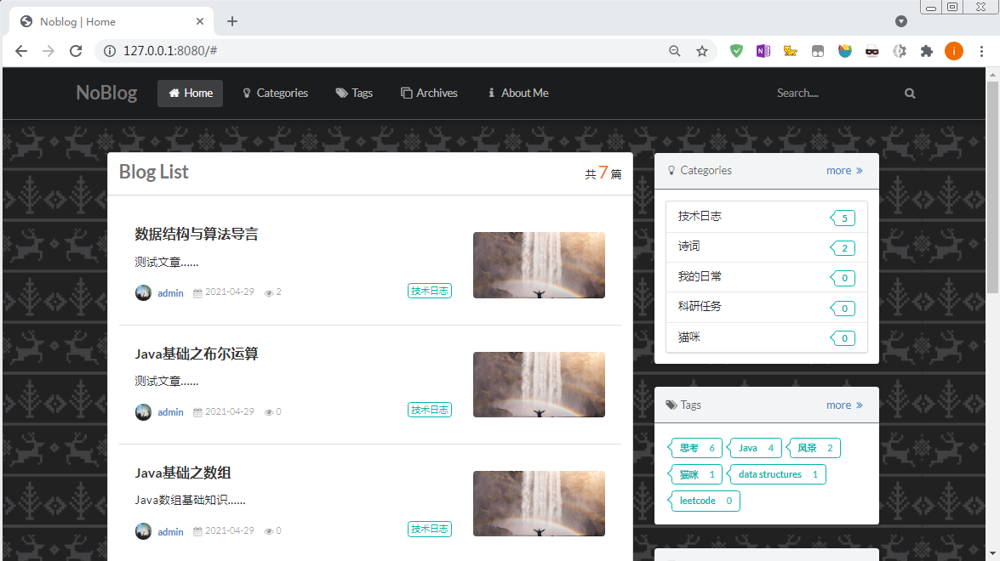

## Personal Blog Demo
an elegant, light-weighted personal blog（***Noblog*** v1.1）

* Screen Shot of This Demo



* more demo screen shot [(*baidu cloud*)](https://pan.baidu.com/s/1SBoDtkSoNmIo_7j8jAuz4g)  password: fnpf

### tech stack

* Backend: *spring boot, JPA*
* Database: *MySQL*
* Frontend: *thymeleaf, semantic ui*

### tools & environment

- IntelliJ IDEA
- Navicat Premium 12
- Maven 4.0.0
- JDK 16
- Spring Boot 2.4.5

### Features

#### Frontend display

- **Semantic UI** - user friendly and presents responsive, beautiful layouts;
- **Tag / Category / Archive** - tag articles, put them into categories and archive them by year, make it simple to read and manage;
- **Count Views** - help you find the most popular post.
- **Local Search Engine** - a local search engine, you can search anything you post based on the article title and content.
- **Scrollspy** - automatically updating ToC targets based on scroll position, with the help of [waypoints](https://github.com/imakewebthings/waypoints). and [Tocbot](https://tscanlin.github.io/tocbot/);
- **Read Blogs on Mobile** - scan QR code then you can read the article on mobile, with the help of [QRCode.js](https://github.com/davidshimjs/qrcodejs).

#### Back-Stage Management

- **User-login** - encrypt user password, filter visitors, make blog management safer. 
- **Manage Tag/ Category/ Blog** - manage tags, categories conveniently, and make it faster to locate any article you want to modify.
- **Blog Post** - post blogs with [built-in Markdown editor](https://github.com/pandao/editor.md),  set some features, e.g., enable or disable the blow comment/ sponsorship/ share info , set this article as recommended to make it appears on home page.

### Deploy 

SQL file has already in *Noblog* repo, plug and play.

Modify MySQL, JPA setting in your application.yml:

```yaml
spring:
  datasource:
    driver-class-name: com.mysql.cj.jdbc.Driver
    url: jdbc:mysql://localhost:3306/test_for_blog?serverTimezone=GMT%2B8&useUnicode=true&characterEncoding=utf-8
    username: root
    password: # your mysql password
  jpa:
    hibernate:
      ddl-auto: update
      use-new-id-generator-mappings: false
    show-sql: true
    database-platform: org.hibernate.dialect.MySQL5Dialect
    generate-ddl: true
    open-in-view: false
```

Default: http://127.0.0.1:8080/

Back-Stage login

* Username: admin
* Password: 12345

### Credits

* This blog demo is built refer to [李仁密 - Spring Boot开发小而美的个人博客](https://www.bilibili.com/video/BV1HE411N76x).

